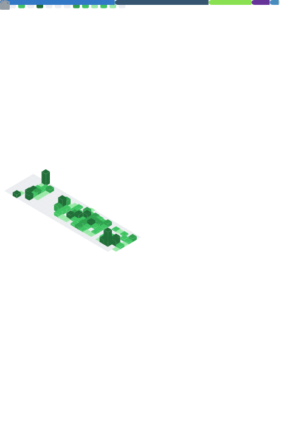

<!--
**JBibu/JBibu** is a ✨ _special_ ✨ repository because its `README.md` (this file) appears on your GitHub profile.

Here are some ideas to get you started:

- 🔭 I’m currently working on ...
- 🌱 I’m currently learning ...
- 👯 I’m looking to collaborate on ...
- 🤔 I’m looking for help with ...
- 💬 Ask me about ...
- 📫 How to reach me: ...
- 😄 Pronouns: ...
- ⚡ Fun fact: ...
-->

## 💡 About Me

Sysadmin learning full-stack development through Web Applications Development (DAW) training. I focus on DevOps, connecting infrastructure and code. I like simple, stable tools that just work. I use clean configs and practical solutions in my work. When I'm not connecting dev and ops, I'm outside getting fresh air.

Always learning.

<a href="https://www.linkedin.com/in/jbibu" target="_blank" rel="noreferrer">More in my LinkedIn</a>

## 💻 My (relevant) tools and langs

### Learning

## 🧩 GitHub Stats

