<!--
**JBibu/JBibu** is a ✨ _special_ ✨ repository because its `README.md` (this file) appears on your GitHub profile.

Here are some ideas to get you started:

- 🔭 I’m currently working on ...
- 🌱 I’m currently learning ...
- 👯 I’m looking to collaborate on ...
- 🤔 I’m looking for help with ...
- 💬 Ask me about ...
- 📫 How to reach me: ...
- 😄 Pronouns: ...
- ⚡ Fun fact: ...
-->

## About Me

Sysadmin and web developer. I focus on building practical solutions that connect server infrastructure with web applications.
I prefer simple, reliable tools and clean configurations. I like to keep up with the tech landscape. When I'm not working with servers or coding, I enjoy spending time outdoors.

 

  
  

 

## My (relevant) tools and langs

### Development

### DevOps

### Learning

## GitHub Stats

